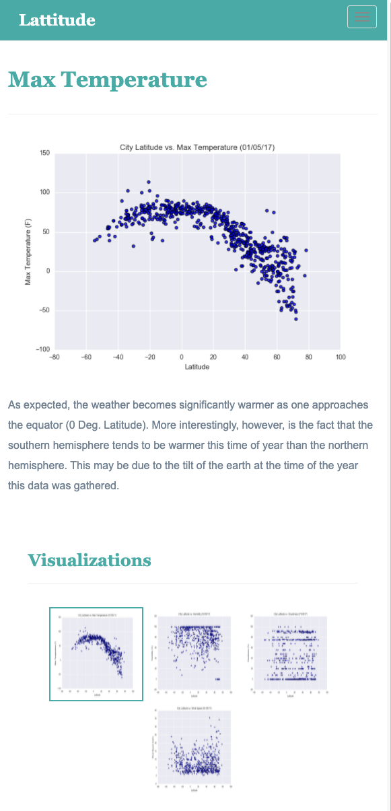

<!-- https://www.w3schools.com/bootstrap4/bootstrap_navbar.asp# -->
<!doctype html>
<html lang="en">
  <head>
    <meta charset="utf-8">
    <meta name="viewport" content="width=device-width, initial-scale=1">
    <title>Bootstrap Visualization Dashboard</title>

    <!-- reset the style -->
    <link rel="stylesheet" href="reset.css">

    <!-- Bootstrap CSS -->
    <link href="https://cdn.jsdelivr.net/npm/bootstrap@5.2.0/dist/css/bootstrap.min.css" rel="stylesheet" integrity="sha384-gH2yIJqKdNHPEq0n4Mqa/HGKIhSkIHeL5AyhkYV8i59U5AR6csBvApHHNl/vI1Bx" crossorigin="anonymous">
    

    <!-- drop down doesnt work with the above latest bootcamp link from https://getbootstrap.com/docs/5.2/getting-started/introduction/...
    this link works: https://stackoverflow.com/questions/12458522/bootstrap-dropdown-not-working -->
    
    

    <!-- Set the style with style.css -->
    <link rel="stylesheet" type="text/css" href="style.css">
  </head>

<body>

  

  <!-- helpful link below -->
 <!-- https://getbootstrap.com/docs/4.0/components/navbar/        -->
          <!-- add drop down  -->

  <!-- Latitude Navigation Bar -->
  
  

      <nav class="navbar navbar-expand-lg navbar-light">
        

          <a class="navbar-brand" style="background-color:rgb(16, 172, 164);" href="index.html">Latitude</a>
          <button class="navbar-toggler border border-black " type="button" data-toggle="collapse" data-target="#navbarSupportedContent"
          aria-controls="navbarSupportedContent" aria-expanded="true" aria-label="Toggle navigation">
          
          </button>
        

        

<!-- Plot, Comparison, Data Navigation Bar -->        
        

          <!-- add drop down  -->
          <!-- this is for small screen adjustment -->
          

          

            <ul class="navbar-nav mr-auto">
              <li class="nav-item dropdown">
                <a class="nav-link dropdown-toggle" id="navbarDropdown" role="button" data-toggle="dropdown" aria-haspopup="true" aria-expanded="false">
                  Plot
                </a>
                

                  <a class="dropdown-item" href="temp.html">Max Temperature</a>
                  <a class="dropdown-item" href="humidity.html">Humidity</a>
                  <a class="dropdown-item" href="cloudiness.html">Cloudiness</a>
                  <a class="dropdown-item" href="windspeed.html">Wind Speed</a>
                  
                

              </li>
              <li class="nav-item">
                <a class="nav-link" href="Comparisons.html">Comparison</a>
              </li>
              <li class="nav-item">
                <a class="nav-link" href="data.html">Data</a>
              </li>
                            
            </ul>
          
  
          

      </nav>
  

  <!-- Navigation end -->

      <!-- content -->
      

        

          

              

                <h3>Summary: Latitude vs. X</h3>
                

                

                
                

                
The purpose of this project was to analyze how weather changes as you get closer to the equator. 
                To accomplish this analysis, we first pulled data from the OpenWeatherMap API to assemble a dataset on over 500 cities.
                

                
                
After assembling the dataset,  we used Matplotlib  to plot various aspects of the weather vs. latitude. 
                Factors we looked  at included:  temperature, cloudiness, wind speed, and humidity. 
                This site provides thesource data and visualizations created as part of the analysis, as well as explanations and descriptions
                of any trends and correlations witnessed. 

              

          

        

             
          
          <!-- Start of Visualizations imageNav Area -->
          

          <section id="imageNav-area">
            

              <h4 class="imageNav-header">Visualizations</h4>
              

              

                       

                        

                    
                        

                        

                    
                

                        

                    
                        

                        

                    
                        

                

                    

              

            

          

       <!-- containter end -->
  <!-- footer -->
    <footer>
    
&copy; Copyright Sung Ahn 2022

    

  </footer>
  <!-- footer end -->
</body>

</html>

# Unit 11 Homework: Web Visualization Dashboard 

## Background

Data is more powerful when we share it with others! Let's use what we've learned about HTML and CSS to create a dashboard featuring the analysis that we've done, as captured in the following image:

  

## Before You Begin

1. Create a new repository for this project called `Web-Design-Challenge`. **Do not add this homework to an existing repository**.

2. Clone the new repository to your computer.

3. Inside your local Git repository, add your HTML files along with three folders; `assets`, `Resources` and `visualizations`. 

  * Include an `index.html` file in the main folder, which you will edit later, and which will be the landing page that a user first encounters when viewing your submission.

  * Inside the `assets` folder, create two more folders: `css` and `images`, which you will use to store your CSS and image assets, respectively.

  * The `Resources` folder should contain the CSV file with the data you are using for this website. The `visualizations` folder will contain the HTML pages that display your visualizations.

4. Push the changes from Steps 1 through 3 to GitHub.

5. Deploy to GitHub Pages. 

## Instructions 

For this homework assignment, you'll create a website by using visualizations that were created in your Python-APIs homework, or you can use the [weather data](Resources/cities.csv) provided.

As you build this dashboard, you'll create individual pages for each plot and a way to navigate between them. You will also build a landing page to provide a comparison of all the plots, along with another page to present the data used to build them.

### Website Requirements

For reference, review the following ["Screenshots" section](#screenshots). 

The website must consist of seven pages in total, including:

* A [landing page](#landing-page) containing the following elements:

  * An explanation of the project

  * Links to each visualizations page. There should be a sidebar containing preview images of each plot. Clicking an image should take the user to that visualization.

* Four [visualization pages](#visualization-pages), stored in the `visualizations` folder, each with the following elements:

  * A descriptive title and heading tag.

  * The plot or visualization for the selected comparison (latitude vs: max temperature, humidity, cloudiness, or wind speed). The images displayed on these pages should be stored in the `assets/images` folder.

  * A paragraph describing the plot and its significance.

* A ["Comparisons" page](#comparisons-page) that does the following:

  * Contains all of the visualizations on the same page so they can easily be compared with each other.

  * Uses a Bootstrap grid for the visualizations.

    * The grid must be two visualizations across medium and large screens, and it must be one visualization across on extra-small or small screens.

* A ["Data" page](#data-page) that displays a responsive table containing the data used in the visualizations.

  * The table must be a Bootstrap table component. Refer to the [Bootstrap documentation](https://getbootstrap.com/docs/4.3/content/tables/#responsive-tables) for how to use responsive tables. 

  * The data must come from exporting the `.csv` file as HTML or by converting it to HTML. Try using a tool that you already know: Pandas. Pandas has a method, appropriately called `to_html`, that allows you to generate an HTML table from a Pandas DataFrame. To learn more, review the [documentation](https://pandas.pydata.org/pandas-docs/version/0.17.0/generated/pandas.DataFrame.to_html.html).

At the top of every page, the website must have a navigation menu with the following elements:

* It should have the name of the site on the left of the navigation bar, allowing users to return to the landing page from any page.

* It should contain a dropdown menu on the right of the navigation bar, named "Plots," to provide links to each individual visualization page.

* It should provide two more text links on the right: "Comparisons," which links to the comparisons page, and "Data," which links to the data page.

* It should be responsive (using media queries). The navigation bar must be similar to the screenshots in the ["Navigation Menu" section](#navigation-menu) (notice the background color change).

Finally, the website must be deployed to GitHub Pages.

Once finished, submit links to 1) the deployed app and 2) the GitHub repository.

Ensure your repository has regular commits and a descriptive `README.md` file.

### Considerations

* You may use the weather data you collected for the WeatherPy section of your Python-APIs Homework, or you may use the included [cities dataset](Resources/cities.csv) and pull the images from the [assets folder](Resources/assets).

* You must use Bootstrap. This includes using the Bootstrap `navbar` component for the header on every page, the Bootstrap table component for the data page, and the Bootstrap grid for responsiveness on the comparison page.

* You must deploy your website to GitHub Pages, with the website working on a live, publicly accessible URL as a result.

* Make sure to use a CSS media query that uses Bootstrap and/or `@media` for the navigation bar.

* Make sure that your website works at all window widths or sizes.

* Feel free to take some liberty in the visual aspects, but keep the  core functionality the same.

### Bonus

For an extra challenge, try the following: 

* Use a different dataset! The requirements just described still hold, but make it your own.

* Use a Bootstrap theme to customize your website. You can use a tool like [Bootswatch](https://bootswatch.com/), but make sure you also meet all of the requirements listed earlier.

* Add extra visualizations. 
* Use meaningful glyphicons next to the links in the header.

* Have visualization navigation on every visualization page with an active state, as in the following screenshots.

### Screenshots

This section contains screenshots of each page that must be built, at varying screen widths. These are intended as a guide; you can meet the requirements without having the pages match the following images exactly.

#### Landing page

Large screen:

Small screen:



#### Comparisons page

Large screen:

Small screen:

#### Data page

Large screen:

Small screen:

#### Visualization pages

You'll build four of these, one for each visualization. Here's an example of one visualization page on two different screen sizes:

Large screen:

Small screen:

#### Navigation menu

Large screen:

Small screen:

## Rubric

[Unit 11 Homework Rubric](https://docs.google.com/document/d/16RJehl9qVOxdj7o7hUwvdlsoyrA_-kaoB8CGwr9LX_Y/edit?usp=sharing)

- - -

## References

OpenWeatherMap.org. (2012). Сurrent weather and forecast. Retrieved from [https://openweathermap.org/](https://openweathermap.org/)

- - -

© 2022 Trilogy Education Services, a 2U, Inc. brand. All Rights Reserved.

